# 1. 데이터 수집 모듈 사용 가이드

## 1.1 개요

**데이터 수집 모듈은 Open API, oneM2M, FIWARE, U-City Platform, RDBMS 등 여러 유형의 플랫폼이 제공하는 데이터를 수집하여 변환하고 적재하는 모듈입니다. City Data Hub에서 사용하는 NGSI-LD 데이터 모델에 맞게 데이터를 변환할 필요가 있는 경우 데이터 수집 모듈에서 어댑터를 이용하여 데이터를 적재합니다. 이 경우 Web UI를 통해 작업 가능하며 어댑터의 실행/정지를 통해 관리할 수 있습니다.**


## 1.2 특징

- Apache Flume 기반의 데이터 수집 어댑터 추가, 실행 관리 및 모니터링 제공
- 공공 API, oneM2M, FIWARE NGSIv2, U-City 통합플랫폼, RDBMS 연계 어댑터 제공
- 외부 데이터 수집 연계 시 데이터 모델 변환 기능 제공

## 1.3 구성도


데이터 수집 모듈은 데이터 수집 관리와 Apache Flume으로 구성됩니다. 데이터 수집 관리는 Web UI와 Daemon으로 나뉩니다.

- Web UI : 관리자가 화면을 통해 어댑터를 생성/설정/제거할 수 있고, Apache Flume 위에 구동하고 있는 어댑터 인스턴스의 묶음인 에이전트를 실행/정지/모니터링 할 수 있습니다.
- Daemon : Web UI를 통해 작업된 내용을 Apache Flume에 전달하여 실행하고 각 에이전트의 상태를 체크하고 변환클래스의 컴파일을 지원하는 기능을 가집니다.
- Apache Flume : 대상 시스템에 접속하여 데이터를 수집하고 변환하여 데이터 코어에 적재하는 어댑터 인스턴스를 에이전트 단위로 묶어 구동하는 프레임워크입니다.

여기서 어댑터는 데이터를 수집하는 대상시스템의 정보와 변환하고 하는 데이터 모델 정보 그리고 변환클래스 정보 등을 통해 유형으로 등록할 수 있습니다.

어댑터 인스턴스는 어댑터 유형으로부터 파라미터 값을 설정하여 특정된 데이터를 수집하여 변환하고 적재하는 구현체입니다.

예를 들어 기상청 날씨정보를 수집하여 변환하여 적재하는 경우, 기상관측 어댑터 유형을 파라미터(기상청 서비스 API 주소, 서비스키, 측정 날짜, 측정 시간, 위치 등)를 설정하여 생성한 후, 어댑터 인스턴스로 어댑터 유형의 파라미터에 특정값(행정1동)을 설정하여 추가함으로서 1시간에 한번씩 데이터를 수집할 수 있도록 구현합니다.

행정2동, 행정3동의 어댑터 인스턴스를 추가하여 행정동 기상관측 에이전트로 묶어 실행/정지/모니터링 할 수 있습니다. 에이전트의 경우 서로 다른 어댑터 유형으로 조합할 수 있고 도시의 행정구역 내의 미세먼지, 날씨, 에너지 사용량 등을 묶어 관리 가능합니다.

# 2. 설치

centos7 기준으로 설치를 진행합니다.

## 2.1 시스템 세팅

### 구동환경

- openjdk 1.8
- git
- docker
- maven

```bash
# openjdk 1.8 , git download
sudo yum install -y java-1.8.0-openjdk  java-1.8.0-openjdk-devel git
```

### 2.1.1 apache maven 설치

[https://maven.apache.org/](https://maven.apache.org/) 에서 3.8.4 다운로드

```bash
# wget install
sudo yum install -y wget 

# maven 3.8.6 download
wget https://dlcdn.apache.org/maven/maven-3/3.8.6/binaries/apache-maven-3.8.6-bin.tar.gz

# extract apache-maven-3.8.6-bin.tar.gz
tar -xvf apache-maven-3.8.6-bin.tar.gz

# delete apache-maven-3.8.6-bin.tar.gz
rm -rf apache-maven-3.8.6-bin.tar.gz

# regist MAVEN_HOME
vi ~/.bash_profile
```

```bash
# .bash_profile에 다음 내용 삽입
export MAVEN_HOME=~/apache-maven-3.8.4
PATH=$PATH:$HOME/bin:$MAVEN_HOME/bin
```

```bash
# source 실행
source ~/.bash_profile
```

### 2.1.2 docker 설치

**[https://docs.docker.com/engine/install/centos/](https://docs.docker.com/engine/install/centos/) : centos docker 설치 가이드**

- 저장소 설정
yum-utils 패키지(yum-config-manager 유틸리티 제공)를 설치하고 안정적인 저장소를 설정합니다.

```bash
sudo yum install -y yum-utils
sudo yum-config-manager --add-repo https://download.docker.com/linux/centos/docker-ce.repo
```

- docker 설치

```bash
sudo yum install docker-ce docker-ce-cli containerd.io docker-compose-plugin

# docker 시작
sudo systemctl start docker

# docker 상태
sudo systemctl status docker

# docker 자동시작
sudo systemctl enable docker
```

- 만약 도커 사용 중 'permission denied' 오류가 발생 했을 경우
  
```bash
# docker group 이 없을 경우 그룹 생성
sudo groupadd docker

# docker group에 해당 유저를 추가
sudo usermod -aG docker $USER

# 로그아웃 후 다시 로그인하거나 다음 명령어를 실행시켜야 적용이 된다
newgrp docker
```

## 2.2 서비스 설치

### 2.2.1 파일 다운로드

CityDataHub-Ingest모듈을 github에서 다운받을 수 있습니다. 아래 명령어를 통해 파일을 다운로드 합니다.

```bash
git clone https://github.com/IoTKETI/citydatahub_data_ingest_module.git ingest
```

### 2.2.2 build

다운로드 한 수집모듈의 디렉토리(ingest) 로 이동하여 빌드합니다.

```bash
# 디렉토리 이동
cd ~/ingest

# build 
mvn clean install

# 빌드 후에 생성된 파일을 카피
yes | cp -f ingest-adapter/target/ingest-adapter-0.9.1.jar ingest-daemon/src/main/docker/agent/lib/
```

### 2.2.3 docker image 만들기

메이븐 빌드를 이용하여 docker images 를 생성할 수 있습니다. 다음 명령어를 통해 docker images를 생성합니다.

```bash
# 디렉토리 이동
cd ~/ingest/ingest-daemon

# 데몬 이미지 만들기
mvn package docker:build

# 디렉토리 이동
cd ~/ingest/ingest-web
# 웹UI 이미지 만들기
mvn package docker:build
```
  

*도커 빌드 후 이미지 리스트*

# 3 DOCKER CONTAINER 생성

## 3.1 설정

docker-compose.yml 파일에 각 시스템에 맞게 설정할 수 있습니다. 다음의 내용을 참조하여 설정하신 후 docker container 를 생성합니다.

```yaml
#docker-compose.yml 전체내용
version: '3'
  
services:
  ingest-db:
    container_name: ingest-db
    image: postgis/postgis:11-2.5-alpine
    hostname: ingest-db
    environment:
      - TZ=Asia/Seoul
      - POSTGRES_DBNAME=postgres
      - POSTGRES_USER=postgres
      - POSTGRES_PASSWORD=pine1234
    ports:
      - 5430:5432
    volumes:
      - ./db/init.sql:/docker-entrypoint-initdb.d/init.sql
    restart: on-failure
    healthcheck:
      test: "exit 0"

  ingest-daemon:
    container_name: ingest-daemon
    image: pinecni/ingest-daemon:latest
    hostname: ingest-daemon
    ports:
      - 8888:8888    
    volumes:
      -  log-data:/opt/logs  
    environment:
      - TZ=Asia/Seoul
      - DATAMODEL_API_URL=http://10.0.0.36:8080/datamodels
      - INGEST_INTERFACE_API_URL=http://10.0.0.25:8080/entityOperations/upsert?options=update
    depends_on:
      ingest-db:
        condition: service_healthy

  ingest-web:
    container_name: ingest-web
    image: pinecni/ingest-web:latest 
    hostname: ingest-web
    ports:
      - 8080:8080
    volumes:
      -  log-data:/opt/logs 
    environment:
      - TZ=Asia/Seoul
      - DATASOURCE_DRIVER=org.postgresql.Driver
      - DATASOURCE_URL=jdbc:postgresql://postgres:5432/postgres
      - DATASOURCE_ID=postgres
      - DATASOURCE_PW=pine1234
      - DAEMON_URL=http://ingestdaemon:8888
      - DATAMODEL_API_URL=http://10.0.0.36:8080/datamodels
      - INGEST_INTERFACE_API_USE_YN=Y
      - INGEST_INTERFACE_API_URL=http://10.0.0.25:8080/entityOperations/upsert
      - AUTH_YN=N
      - AUTH_EXTERNAL_URL=http://203.253.128.181:30084
      - AUTH_INTERNAL_URL=http://10.0.0.237:30000
      - AUTH_CLIENT_ID=V43z0o2boLrXia0E5zn6
      - AUTH_CLIENT_SECRET=YikQaYqOaHvIvOpGt42lfGvxAiJ4DsYY
      - AUTN_REDIRECT_URL=http://203.253.128.181:9208
      - EUREKA_ENABLED=false
      - EUREKA_EUREKA_DEFAULT_ZONE=http://10.0.0.144:8888/eureka
    depends_on:
      ingest-db:
        condition: service_healthy
      ingest-daemon:
        condition: service_started
volumes:
  log-data:        
```

**docker-compose.yml 변수 설명**

- TZ : 타임존 설정
- DATASOURCE_DRIVER : Database 에 접속하기 위한 driver 를 설정합니다.
- DATASOURCE_URL : Database 에 접속하기 위한 jdbc URL 를 설정합니다.
- DATASOURCE_ID : Database 에 접속하기 위한 ID 를 설정합니다.
- DATASOURCE_PW : Database 에 접속하기 위한 PW 를 설정합니다.
- DAEMON_URL : 데몬서버 주소를 설정합니다. 데몬서버는 관리UI 화면에서 아답터 제어를 하기 위한 서버입니다.
- DATAMODEL_API_URL : City Data Hub 시스템의 데이터 모델의 스키마 서버의 주소를 설정합니다.
- INGEST_INTERFACE_API_USE_YN : City Data Hub 시스템의 INTERFACE API 서버의 사용여부를 설정합니다.(Y,N)
- INGEST_INTERFACE_API_URL : City Data Hub 시스템의 INTERFACE API 서버의 주소를 설정합니다.
- AUTH_YN : City Data Hub 시스템의 인증서버의 사용여부를 설정합니다.(Y,N)
- AUTH_EXTERNAL_URL : City Data Hub 시스템의 인증서버 외부 URL 설정합니다.
- AUTH_INTERNAL_URL : City Data Hub 시스템의 인증서버 내부 URL 설정합니다.
- AUTH_CLIENT_ID : City Data Hub 시스템의 인증서버에서 등록한 클라이언트 아이디 설정합니다.
- AUTH_CLIENT_SECRET : City Data Hub 시스템의 인증서버에서 등록한 클라이언트 시크릿키 설정합니다.
- AUTH_REDIRECT_URL : City Data Hub 시스템의 인증서버에서 등록한 리다이렉트되는 주소 설정
- EUREKA_ENABLED : City Data Hub 시스템의 EUREKA 서버의 사용여부를 설정합니다.(true, false)
- EUREKA_EUREKA_DEFAULT_ZONE : City Data Hub 시스템의 EUREKA 서버의 URL 설정합니다.

### 3.2. docker-compose 실행


*도커 컴포즈 실행*

```bash
# 디렉토리 이동
cd ~/ingest/docker

# 컨테이너 실행 (백그라운드 실행)
docker compose up -d 
```


*도커 컴포즈 후 생성된 컨테이너 리스트*

```bash
# 컨테이너 리스트
docker ps -a 
```

**도커 명령어**

```bash
# 도커 컴포즈 시박
docker compose start

# 도커 컴포즈 중지
docker compose stop

# 도커 컴포즈 제거
docker compose down

# 도커 컴포즈 로그 보기
docker compose logs 

# 컨테이너별 ingest-web log 보기
docker logs ingest-web
```

# 4. 데이터 연계

## 4.1 공공데이터포털(data.go.kr) Open API 데이터 연계

공공데이터포털(data.go.kr)에서 기상청에서 제공하는 기상정보를 예제로 하는 데이터 연계입니다.

1. 공공데이터포털(data.go.kr)에 가입 후 '**데이터 찾기**' 메뉴에서 '**기상청 단기예보**' 로 검색 합니다.
2. 검색결과에서 를 선택합니다. 목록에서 '**기상청_단기예보 ((구)_동네예보) 조회서비스**' 활용신청합니다.


3. '**기상청_단기예보 ((구)_동네예보) 조회서비스**' 활용 신청 후 (초단기실황조회, 초단기예보조회, 단기예보조회, 예보버전조회) 가 서비스 가능합니다.


4. 각 서비스에서  을 클릭하면 간단하게 서비스를 테스트 할 수 있습니다.


**초단기실황조회 확인 결과 화면**


**발급받은 키를 인증키에 넣고 미리보기 결과 화면**

5. 수집관리UI(<http://localhost:8080/>) 의 **Agent 관리** > **Agent 설정** 메뉴에서  을 클릭합니다.


저장 후에는 **Adaptor 추가 등록 / 변경** 을 할 수 있습니다.

- *Agent ID* : '**M000000001**' 을 입력합니다.(10자내 입력)
- *Agent 명* : '**성남시 기상관측**' 을 입력합니다.
- *사용여부* : '**사용**' 를 선택합니다.

6. **Agent설정** 화면에서 저장 후 **Adaptor 추가 등록/변경** 화면에서  을 클릭합니다. 


- *Adaptor ID* : '**pocWeatherObserved**' 를 입력합니다.
- *Adaptor 명* : '**성남시 기상관측**' 을 입력합니다.
- *Platform 유형* : '**Open API**' 선택합니다. (Open API, OneM2M Platform, RDBMS, U-City Platform, FIWARE Platform, 기타)

**아답터_등록 후 화면** 목록에서 **Adaptor ID** 인 **pocWeatherObserved** 를 클릭 하면 **Instance 관리** 화면으로 이동합니다.

7. **Instance 관리** 화면에서  클릭합니다.
   

- *인스턴스명* : '**성남시 기상관측**' 을 입력합니다.
- *데이터모델 변환* : '**변환**' 선택합니다. 변환은 Web 에서 직접 코딩을 하여 데이터를 컨버팅 합니다. 미변환은 기 제공된 Java Class 를 이용합니다.
- *Adpator 유형* : '**성남시 기상관측**' 을 선택합니다. 메뉴 **Adaptor 유형 관리**에서 등록 된 유형을 선택할 수 있습니다. 유형을 선택하면 인스턴스 상세 항목이 표시됩니다.
- *사용여부* : '**사용**' 을 선택합니다.

**인스턴스 등록 필수 정보**


- *DATASET_ID* : '**pocWeatherObserved**' 를 입력합니다. City Data Hub 시스템의 데이터셋 아이디를 입력합니다.
- *MODEL_ID* : '**WeatherObserved**' 를 입력합니다. City Data Hub 시스템의 모델 아이디를 입력합니다.
- *INVOKE_CLASS* : '**com.cityhub.adapter.convex.ConvWeatherObserved**' 를 입력합니다. 변환 클래스입니다.
- *CONN_TERM* : '**3600**' 를 입력합니다. 초단위이며 1시간(60*60) 단위로 데이터를 가져옵니다.

**인스턴스 데이터 메타정보**


- *ParamVarible* : '**base_date,base_time**' 를 입력합니다. 기상측정OPEN API에서 가변값 처리를 위해 사용할 변수를 설정합니다.
- *base_date* : '**yyyyMMdd,MINUTE,-40**' 를 입력합니다. 20220920으로 변환되며 '**MINUTE,-40**' 은 현시간으로부터 40분전을 의미합니다. 9월21일 0시 30분에 수집할 경우 20220921이 아닌 20220920으로 반환합니다.
- *base_time* : '**HHmm,MINUTE,-40**' 를 입렵합니다. 현재 시간이 오후 3시 45분일 경우 1505으로 변환됩니다. 이와같이 하는 이유는 기상청 정보 갱신주기 문제로 인해서 입니다.
- *gs1Code* : '**urn:datahub:WeatherObserved:14858**' 를 입력합니다. 성남시 수정구의 아이디 값입니다.
- *url_addr* : '**http://apis.data.go.kr/1360000/VilageFcstInfoService_2.0/getUltraSrtNcst?dataType=json&numOfRows=1000&&nx=63&ny=124serviceKey=**' 를 입력합니다. **serviceKey** 서비스키는 공공데이터포털에서 활용신청 후 발급 받은 키를 적용해 주시면 됩니다. '**nx=63, ny=124**' 는 기상정보를 구하고자하는 위경도 입니다.
- *addressCountry* : '**KR**' 를 입력합니다. WeatherObserved 모델의 구성 요소입니다.
- *addressRegion* : '**경기도**' 를 입력합니다. WeatherObserved 모델의 구성 요소입니다.
- *addressLocality* : '**성남시**' 를 입력합니다. WeatherObserved 모델의 구성 요소입니다.
- *addressTown* : '**수정구**'  를 입력합니다. WeatherObserved 모델의 구성 요소입니다.
- *streetAddress* : '**경기도 성남시 수정구 수정로 319**' 를 입력합니다. WeatherObserved 모델의 구성 요소입니다.
- *location* : '**[127.14858, 37.4557691]**' 를 입력합니다. WeatherObserved 모델의 구성 요소입니다.

8. 성남시기상관측을 인스턴스를 저장을 합니다.  버튼을 클릭하여 저장된 설정을 적용합니다.
   
9. **Agent관리** > **Agent 운영** 메뉴에서 **Agent ID** -> **M000000001** 을 클릭합니다.
   
   '**성남시 기상관측**' 어댑터에서 **시작/중지** , **모니터링**이 가능합니다, 모니터링 버트을 클릭하면 다음과 같이 **모니터링 로그팝업** 이 뜹니다.
   


### 4.1.1 어댑터유형관리

- **어댑터유형관리**
</br>
어댑터 유형 (Open API, oneM2M Platform, U-City Platform, LegacySystem(RDBMS), FIWARE Platform, 기타)의 기본 항목을 저장할 수 있습니다. 여기서 등록된 항목은 인스턴스 등록의 "Adaptor 유형"에서 활용됩니다.</br>
</br>

- 다음 그림은 어댑터 유형의 세부항목의 입력예제입니다. 성남시 기상관측에 필요한 기본정보 예제화면입니다.
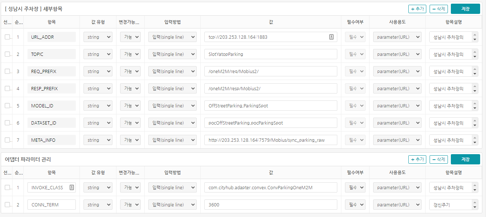</br>

- 어댑터 유형에서 필요한 정보를 기입 후 agent 관리메뉴에서 에이전트를 등록합니다.
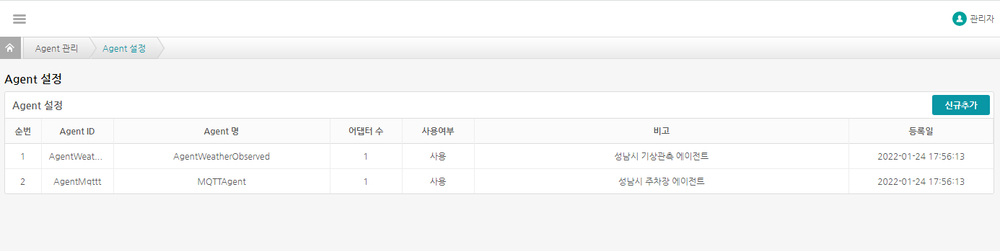</br>
등록된 에이전트 목록을 볼 수 있는 화면입니다.</br>
신규추가버튼을 클릭하면 에이전트를 등록할 수 있습니다.</br>
수정 및 삭제는 목록에서 Agent명을 클릭 후 이동한 화면에서 처리합니다.</br>

</br>

- **에이전트 등록**
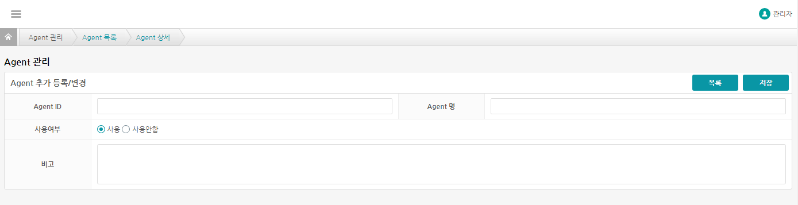</br>
에이전트 등록화면이며 Agent ID,Agent 명,사용여부,비고 를 입력하여 에이전트를 등록합니다.</br>

</br>

- **에이전트 등록 후 화면**
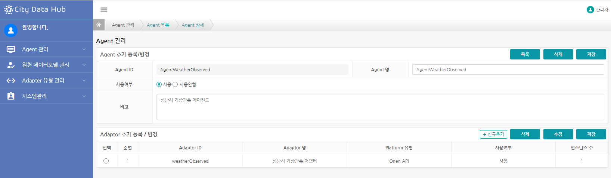</br>
에이전트를 등록 후에 나오는 화면입니다.</br>
에이전트의 수정 및 삭제가 가능합니다.</br>
어댑터의 등록/수정/삭제 또한 가능합니다.</br>
목록에서 Adaptor ID, Adaptor 명을 클릭하면 인스턴스 관리 화면으로 이동합니다.</br>

</br>

- **어댑터 신규추가화면**
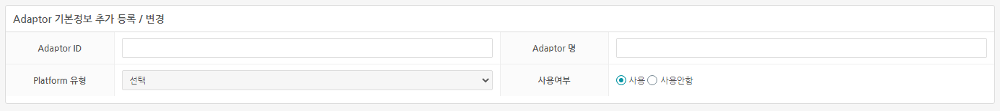</br>
어댑터의 신규추가 화면이며 Adaptor ID, Adaptor 명, Platform 유형, 사용여부를 입력하여 어댑터를 등록합니다.</br>

</br>

- **인스턴스 관리화면**
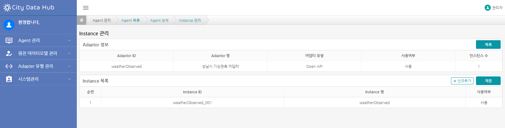</br>
인스턴스 관리화면입니다.</br>

</br>

- **인스턴스 등록화면**
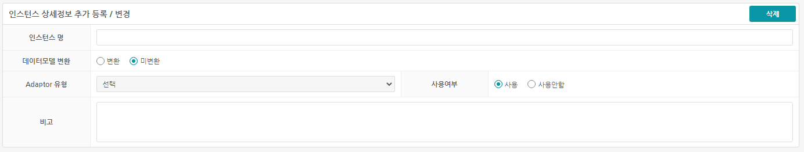</br>
인스턴스 등록화면입니다.</br>
인스턴스 명, 데이터모델 변환, Adaptor 유형, 사용여부, 비고를 입력하여 인스턴스를 등록합니다.</br>
"Adaptor 유형"은 메뉴에서 어댑터 유형관리에서 추가 가능하며, 인스턴스의 기본 추가 옵션항목을 가져올 수 있습니다.</br>
"데이터모델 변환"은 변환을 선택했을 경우  버튼이 생기며 변환 컴파일이 가능합니다. 미 변환을 선택할 경우 등록된 표준모델변환 파일을 이용할 수 있습니다.</br>
"Adaptor 유형"에서 기등록된 성남시 기상관측을 선택하면 인스턴스의 추가 옵션등록/변경화면이 보여집니다.</br>

</br>

- **인스턴스 추가옵션등록화면**
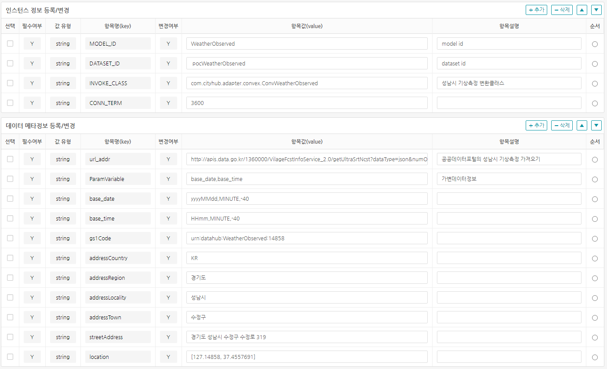</br>
인스턴스 추가옵션화면이여 성남시 기상관측의 등록예제입니다.</br>
사용 중 성남시 기상관측 API의 주소가 변경되었거나, 인증키가 변경되었을 경우 이곳에서 수정을 할 수 있습니다.</br>
항목을 추가,삭제,변경 후 저장을 클릭하면 변경사항이 저장됩니다.</br>

</br>

- **데이터변환관리화면**
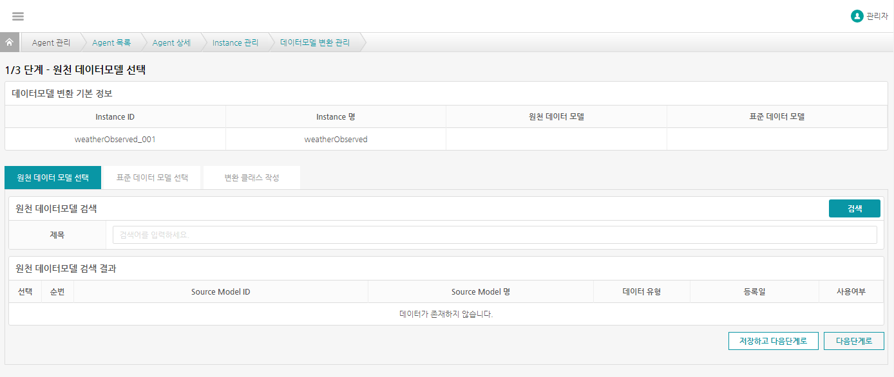</br>
 버튼을 클릭하면 변환관리 화면으로 이동합니다.</br>
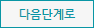 를 클릭하여 변환클래스화면까지 이동합니다.</br>

</br>

- **변환클래스작성**
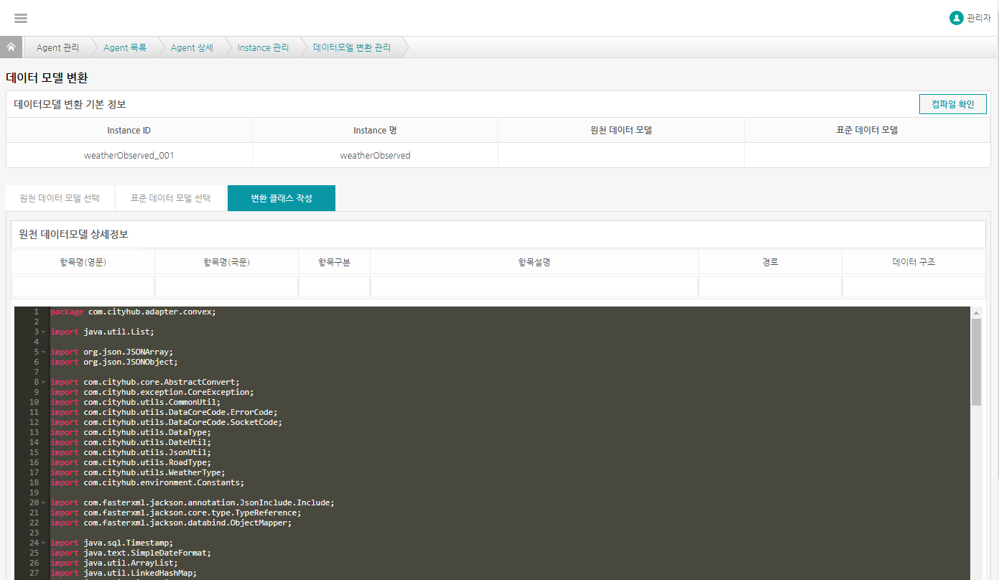</br>
원천소스의 항목과 표준모델의 변환 클래스를 직접 작성하여 컴파일을 하고자 할 때 이용합니다.</br>
"컴파일확인" 버튼을 클릭하면 현재 작성 중인 파일의 유효성을 체크합니다.</br>
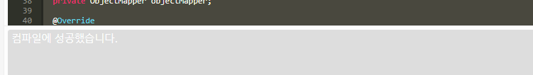</br>
컴파일이 정상적으로 되었을 경우 하단의 텍스트박스에 "컴파일에 성공했습니다" 란 메세지가 출력됩니다.</br>
컴파일이 정상적으로 안될경우 그에 해당하는 메세지를 출력합니다.</br>

</br>

## 4.2 oneM2M Platform 데이터 연계

oneM2M Platform 중 모비우스에서 주차장 정보를 예제로 하는 데이터 연계입니다.

1. postman 또는 curl로 주차장 정보의 리소스를 확인합니다.
   ```curl --location --request GET 'http://203.253.128.164:7579/Mobius/sync_parking_raw?fu=1&ty=3' --header 'Accept: application/json' --header 'X-M2M-Origin: SW001' --header 'X-M2M-RI: cityhub'```
2. 수집관리UI 화면에서 adaptor유형관리의 oneM2M 구독관리 화면으로 이동합니다.
3. 필요한 정보를 기입 후 하위컨테이너 검색 후 구독합니다.
4. adaptor유형별 파라미터관리 화면으로 이동합니다.
5. adaptor유형관리에서 '성남시 주차장' 명칭으로 등록합니다. 이때 대상플랫폼 연계유형은 'oneM2M Platform'를 선택합니다.
6. '성남시 주차장'이 등록 된 후 클릭하면 세부항목을 등록할 수 있습니다.
7. 세부항목으로는 MODEL_ID,DATASET_ID,INVOKE_CLASS,CONN_TERM의 필수 예약어가 있습니다. 주차장 정보를 가져오기 위해 URL_ADDR, REQ_PREFIX,RESP_PREFIX,TOPIC, META_INFO을 등록합니다
8. agent관리의 agent설정화면으로 이동합니다.
9. agent설정화면에서 'AgentMqttt' 명칭으로 agent를 등록합니다.
10. agent를 등록후 'mqttOffstreet'명칭으로 adaptor를 등록합니다. 이때 'platform 유형'은 'oneM2M Platform'를 선택합니다.
11. 'mqttOffstreet' adaptor 에서 'mqttOffstreet_001' 명칭으로 인스턴스를 등록합니다.
12. 이때 'adaptor유형'에는 '성남시 주차장'을 선택하면 "인스턴스 등록/변경" , "데이터 메타정보 등록/변경" 화면이 나옵니다.
13. 여기서 어댑터유형관리(성남시 주차장)에서 등록한 세부항목이 표시되며 수정할 황목이 있을 경우 수정하여 저장을 합니다.
14. RESTful API로 최종 등록 된 성남시 주차장을 적용시킵니다.  
    ```curl --location --request GET 'http://localhost:8080/restApi/pushConf/agent명칭/아답터명칭' --header 'Content-Type: application/json'```
15. agent관리화면으로 이동합니다.
16. '성남시 주차장' 어댑터에서 시작/중지 , 모니터링이 가능합니다

## 4.2.1 어댑터유형관리

- **어댑터유형관리**
</br>
어댑터 유형 (Open API, oneM2M Platform, U-City Platform, RDBMS, FIWARE Platform, 기타)의 기본 항목을 저장할 수 있습니다. 여기서 등록된 항목은 인스턴스 등록의 "Adaptor 유형"에서 활용됩니다.</br>
</br>

- 다음 그림은 어댑터 유형의 세부항목의 입력 예제입니다. 성남시 주차장에 필요한 기본정보 예제화면입니다.
</br>

- 어댑터 유형에서 필요한 정보를 기입 후 agent 관리메뉴에서 에이전트를 등록합니다.
</br>
등록된 에이전트 목록을 볼 수 있는 화면입니다.</br>
신규추가버튼을 클릭하면 에이전트를 등록할 수 있습니다.</br>
수정 및 삭제는 목록에서 Agent명을 클릭 후 이동한 화면에서 처리합니다.</br>

</br>

- **에이전트 등록**
</br>
에이전트 등록화면이며 Agent ID, Agent 명, 사용여부, 비고 를 입력하여 에이전트를 등록합니다.</br>

</br>

- **에이전트 등록 후 화면**
</br>
에이전트를 등록 후에 나오는 화면입니다.</br>
에이전트의 수정 및 삭제가 가능합니다.</br>
어댑터의 등록/수정/삭제 또한 가능합니다.</br>
목록에서 Adaptor ID, Adaptor 명을 클릭하면 인스턴스 관리 화면으로 이동합니다.</br>

</br>

- **어댑터 신규추가화면**
</br>
어댑터의 신규추구 화면이며 Adaptor ID, Adaptor 명, Platform 유형,사용여부를 입력하여 어댑터를 등록합니다.</br>

</br>

- **인스턴스 관리화면**
</br>
인스턴스 관리화면입니다.</br>

</br>

- **인스턴스 등록화면**
</br>
인스턴스 등록화면입니다.</br>
인스턴스 명,데이터모델 변환,Adaptor 유형,사용여부,비고를 입력하여 인스턴스를 등록합니다.</br>
"Adaptor 유형"은 메뉴에서 아답터 유형관리에서 추가 가능하며, 인스턴스의 기본 추가 옵션항목을 가져올 수 있습니다.</br>
"데이터모델 변환"은 변환을 선택했을 경우  버튼이 생기며 변환 컴파일이 가능합니다. 미 변환을 선택할 경우 등록된 표준모델변환 파일을 이용할 수 있습니다.</br>
"Adaptor 유형"에서 기등록된 성남시 주차장을 선택하면 인스턴스의 추가 옵션등록/변경화면이 보여집니다.</br>

</br>

- **인스턴스 추가옵션등록화면**
</br>
인스턴스 추가옵션화면이여 성남시 주차장의 등록예제입니다.</br>
사용 중 성남시 주차장 API의 주소가 변경되었거나, 인증키가 변경되었을 경우 이곳에서 수정을 할 수 있습니다.</br>
항목을 추가,삭제,변경 후 저장을 클릭하면 변경사항이 저장됩니다.</br>

</br>

- **데이터변환관리화면**
</br>
 버튼을 클릭하면 변환관리 화면으로 이동합니다.</br>
 를 클릭하여 변환클래스화면까지 이동합니다.</br>

</br>

- **변환클래스작성**
</br>
원천소스의 항목과 표준모델의 변환 클래스를 직접 작성하여 컴파일을 하고자 할 때 이용합니다.</br>
"컴파일확인" 버튼을 클릭하면 현재 작성 중인 파일의 유효성을 체크합니다.</br>
</br>
컴파일이 정상적으로 되었을 경우 하단의 텍스트박스에 "컴파일에 성공했습니다" 란 메세지가 출력됩니다.</br>
컴파일이 정상적으로 안될경우 그에 해당하는 메세지를 출력합니다.</br>

</br>

## 4.3 FIWARE Platform 데이터 연계

FIWARE Platform 중 Context Broker에서 온도/습도를 예제로 하는 데이터 연계입니다.

1. adaptor유형별 파라미터관리 화면으로 이동합니다.
2. adaptor유형관리에서 'FIWARE유형' 명칭으로 등록합니다. 이때 대상플랫폼연계유형은 'FIWARE Platform'를 선택합니다.
3. 'FIWARE유형'이 등록 된 후 클릭하면 세부항목을 등록할 수 있습니다.
4. 어댑터 파라미터 관리 항목 MODEL_ID,DATASET_ID,INVOKE_CLASS,CONN_TERM의 필수 예약어가 있습니다.
5. agent관리의 agent설정화면으로 이동합니다.
6. agent설정화면에서 'fiwareWeatherMeasurement' 명칭으로 agent를 등록합니다.
7. agent를 등록후 'fiwareWeatherMeasurementAdator'명칭으로 adaptor를 등록합니다. 이때 platform 유형은 'FIWARE Platform'를 선택합니다.
8. 'fiwareWeatherMeasurementAdator' adaptor 에서 'fiwareWeatherMeasurementAdator_001' 명칭으로 인스턴스를 등록합니다.
9. 이때 'adaptor유형'에는 'FIWARE유형'을 선택하면 "인스턴스 등록/변경" , "데이터 메타정보 등록/변경" 화면이 나옵니다.
10. 여기서 아답터유형관리(Fiware유형)에서 등록한 세부항목이 표시되며 수정할 황목이 있을 경우 수정하여 저장을 합니다.
11. RESTful API로 최종 등록 된 WeatherMeasurement을 적용시킵니다.  
    ```curl --location --request GET 'http://localhost:8080/restApi/pushConf/agent명칭/아답터명칭' --header 'Content-Type: application/json'```
12. agent관리화면으로 이동합니다.
13. 'WeatherMeasurement' 어댑터에서 시작/중지 , 모니터링이 가능합니다

## 4.4 RDBMS 데이터 연계

RDBMS 중 PostgreSQL에서 상수도 사용량을 예제로 하는 데이터 연계입니다.

1. adaptor유형별 파라미터관리 화면으로 이동합니다.
2. adaptor유형관리에서 'RDBMS상수도' 명칭으로 등록합니다. 이때 대상플랫폼연계유형은 'RDBMS'를 선택합니다.
3. 'RDBMS상수도'이 등록 된 후 클릭하면 세부항목을 등록할 수 있습니다.
4. 어댑터 파라미터 관리 항목으로는 MODEL_ID,DATASET_ID,INVOKE_CLASS,CONN_TERM의 필수 예약어가 있습니다.
5. 'RDBMS 상수도'의 세부항목은 limitNum, offsetNum,id_prefix,addressCountry, addressRegion,addressLocality,className,url,user,password,sql 등록합니다
6. agent관리의 agent설정화면으로 이동합니다.
7. agent설정화면에서 'AgentRDBMS' 명칭으로 agent를 등록합니다.
8. agent를 등록후 'WaterTapUsage_Legacy_Siheung'명칭으로 adaptor를 등록합니다. 이때 'platform 유형'은 'RDBMS'를 선택합니다.
9. 'WaterTapUsage_Legacy_Siheung' adaptor 에서 'WaterTapUsage_Legacy_Siheung_001' 명칭으로 인스턴스를 등록합니다.
10. 이때 'adaptor유형'에는 'RDBMS상수도'을 선택하면 "인스턴스 등록/변경" , "데이터 메타정보 등록/변경" 화면이 나옵니다.
11. 여기서 아답터유형관리(RDBMS상수도)에서 등록한 세부항목이 표시되며 수정할 황목이 있을 경우 수정하여 저장을 합니다.
12. RESTful API로 최종 등록 된 RDBMS상수도을 적용시킵니다.  
    ```curl --location --request GET 'http://localhost:8080/restApi/pushConf/agent명칭/아답터명칭' --header 'Content-Type: application/json'```
14. agent관리화면으로 이동합니다.
15. 'RDBMS상수도' 어댑터에서 시작/중지 , 모니터링이 가능합니다

## 4.5 U-City Platform 정보 데이터 연동하기

U-City Platform 중 스마트시티 통합플랫폼에서 이벤트 정보를 예제로 하는 데이터 연계입니다.

1. adaptor유형별 파라미터관리 화면으로 이동합니다.
2. adaptor유형관리에서 'U-City 통합 플랫폼' 명칭으로 등록합니다. 이때 대상플랫폼연계유형은 'U-City Platform'를 선택합니다.
3. 'UCityPlatformEventType'이 등록 된 후 클릭하면 세부항목을 등록할 수 있습니다.
4. 어댑터 파라미터 관리 항목 MODEL_ID,DATASET_ID,INVOKE_CLASS,CONN_TERM의 필수 예약어가 있습니다. 'U-City 통합 플랫폼 UCityPlatformEvent'의 세부항목은 gs1Code, location, addressCountry, addressRegion, addressLocality, addressTown, streetAddress을 등록합니다
5. agent관리의 agent설정화면으로 이동합니다.
6. agent설정화면에서 'AgentUCityPlatformEvent' 명칭으로 agent를 등록합니다.
7. agent를 등록후 'UCityPlatformEvent'명칭으로 adaptor를 등록합니다. 이때 'platform 유형'은 'U-City Platform'를 선택합니다.
8. 'UCityPlatformEvent' adaptor 에서 'UCityPlatformEvent_001' 명칭으로 인스턴스를 등록합니다.
9. 이때 'adaptor유형'에는 'UCityPlatformEventType'을 선택하면 "인스턴스 등록/변경" , "데이터 메타정보 등록/변경" 화면이 나옵니다.
10. 여기서 아답터유형관리(UCityPlatformEventType)에서 등록한 세부항목이 표시되며 수정할 황목이 있을 경우 수정하여 저장을 합니다.
11. restApi로 최종 등록 된 UCityPlatformEvent을 적용시킵니다.  
    ```curl --location --request GET 'http://localhost:8080/restApi/pushConf/agent명칭/아답터명칭' --header 'Content-Type: application/json'```
12. agent관리화면으로 이동합니다.
13. 'UCityPlatformEvent' 어댑터에서 시작/중지 , 모니터링이 가능합니다

# 5. 실행/중지

## 5.1 아답터 실행/중지

- **아답터모니터링**
</br>
아답터 모니터링화면입니다. 메뉴에서 Agent 관리화면에서 Agent ID를 클릭하여 모니터링 화면으로 이동합니다.</br>
</br>
아답터의 시작/중지 및 로그를 확인할 수 있습니다.</br>
에이전트 모니터링에서 시작 버튼이 보이지 않을 시에는 해당 모델의 pushConf api를 호출하셔야 합니다</br>
`http://localhost:8080/restApi/pushConf/AgentWeatherObserved/weatherObserved`
아답터 시작버튼을 클릭하면 "재시작", "종료" 버튼이 보여집니다. "모니터링"을 클릭하면 로그를 확인할 수 있습니다.</br>

## 5.2 로그 확인

아답터 모니터링 화면에서 모니터링 버튼을 클릭하면 보실 수 있습니다.</br>
</br>

# 6. trouble shooting

기상청 데이터를 가지고 오지 못하거나 주소가 변경 되었을 경우 공공데이터 포털에 활용신청 후 발급된 인증키를 현 서비스에 갱신해 주시면 사용이 가능합니다.


- 1 수정 -> `http://apis.data.go.kr/1360000/VilageFcstInfoService_2.0/getUltraSrtNcst?dataType=json&numOfRows=1000`
- 2 수정 -> `xxu2gHkHh5PrWLXUSnk%2BqICJc2%2FwsENQLJnapmbP0S52Jg7FxIFohMk3FfhI5mkp5Dz7ir%2FuocdMHrnGEP9ZBQ%3D%3D`

**docker images save & load**


```bash
# docker images 목록
docker images

# docker images 파일로 저장
docker save pinecni/ingest-daemon:latest -o pinecni-ingest-daemon.tar
docker save pinecni/ingest-web:latest -o pinecni-ingest-web.tar

# docker images 파일 -> 이미지로 로드
docker load -i  pinecni-ingest-daemon.tar
docker load -i  pinecni-ingest-web.tar
```
