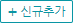
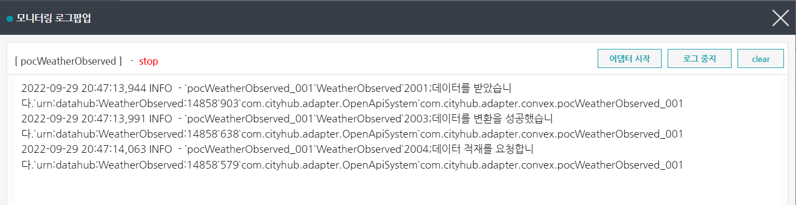
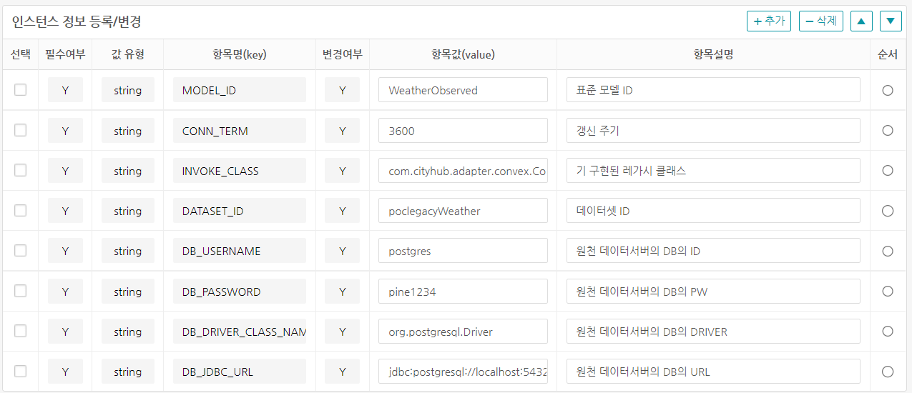
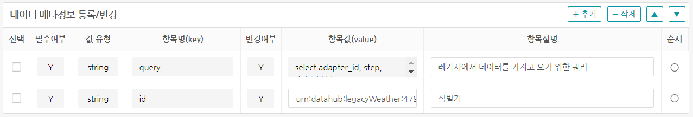
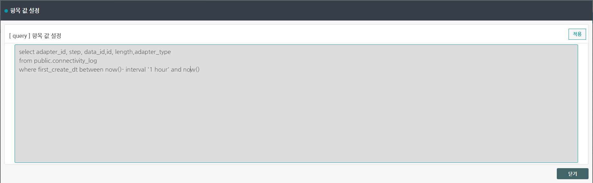

# 1. 데이터 수집 모듈 사용 가이드

## 1.1 개요

**데이터 수집 모듈은 Open API, oneM2M, FIWARE, U-City Platform, RDBMS 등 여러 유형의 플랫폼이 제공하는 데이터를 수집하여 변환하고 적재하는 모듈입니다. City Data Hub에서 사용하는 NGSI-LD 데이터 모델에 맞게 데이터를 변환할 필요가 있는 경우 데이터 수집 모듈에서 어댑터를 이용하여 데이터를 적재합니다. 이 경우 Web UI를 통해 작업 가능하며 어댑터의 실행/정지를 통해 관리할 수 있습니다.**


## 1.2 특징

- Apache Flume 기반의 데이터 수집 어댑터 추가, 실행 관리 및 모니터링 제공
- 공공 API, oneM2M, FIWARE NGSIv2, U-City 통합플랫폼, RDBMS 연계 어댑터 제공
- 외부 데이터 수집 연계 시 데이터 모델 변환 기능 제공

## 1.3 구성도


데이터 수집 모듈은 데이터 수집 관리와 Apache Flume으로 구성됩니다. 데이터 수집 관리는 Web UI와 Daemon으로 나뉩니다.

- Web UI : 관리자가 화면을 통해 어댑터를 생성/설정/제거할 수 있고, Apache Flume 위에 구동하고 있는 어댑터 인스턴스의 묶음인 에이전트를 실행/정지/모니터링 할 수 있습니다.
- Daemon : Web UI를 통해 작업된 내용을 Apache Flume에 전달하여 실행하고 각 에이전트의 상태를 체크하고 변환클래스의 컴파일을 지원하는 기능을 가집니다.
- Apache Flume : 대상 시스템에 접속하여 데이터를 수집하고 변환하여 데이터 코어에 적재하는 어댑터 인스턴스를 에이전트 단위로 묶어 구동하는 프레임워크입니다.

여기서 어댑터는 데이터를 수집하는 대상시스템의 정보와 변환하고 하는 데이터 모델 정보 그리고 변환클래스 정보 등을 통해 유형으로 등록할 수 있습니다.

어댑터 인스턴스는 어댑터 유형으로부터 파라미터 값을 설정하여 특정된 데이터를 수집하여 변환하고 적재하는 구현체입니다.

예를 들어 기상청 날씨정보를 수집하여 변환하여 적재하는 경우, 기상관측 어댑터 유형을 파라미터(기상청 서비스 API 주소, 서비스키, 측정 날짜, 측정 시간, 위치 등)를 설정하여 생성한 후, 어댑터 인스턴스로 어댑터 유형의 파라미터에 특정값(행정1동)을 설정하여 추가함으로서 1시간에 한번씩 데이터를 수집할 수 있도록 구현합니다.

행정2동, 행정3동의 어댑터 인스턴스를 추가하여 행정동 기상관측 에이전트로 묶어 실행/정지/모니터링 할 수 있습니다. 에이전트의 경우 서로 다른 어댑터 유형으로 조합할 수 있고 도시의 행정구역 내의 미세먼지, 날씨, 에너지 사용량 등을 묶어 관리 가능합니다.

# 2. 설치

centos7 기준으로 설치를 진행합니다.

## 2.1 시스템 세팅

### 구동환경

- openjdk 1.8
- git
- docker
- maven

```bash
# openjdk 1.8 , git download
sudo yum update
sudo yum install -y java-1.8-openjdk.x86_64 java-1.8-openjdk-devel.x86_64
sudo yum install -y git

# 기존 자바 버전 변경(update-alternatives)
update-alternatives --config java
update-alternatives --config javac
```


### 2.1.1 apache maven 설치

[https://maven.apache.org/](https://maven.apache.org/) 에서 3.8.6 다운로드

```bash
# wget install
sudo yum install -y wget 

# maven 3.8.6 download
wget https://dlcdn.apache.org/maven/maven-3/3.8.6/binaries/apache-maven-3.8.6-bin.tar.gz

# extract apache-maven-3.8.6-bin.tar.gz
tar -xvf apache-maven-3.8.6-bin.tar.gz

# delete apache-maven-3.8.6-bin.tar.gz
rm -rf apache-maven-3.8.6-bin.tar.gz

# regist MAVEN_HOME
vi ~/.bash_profile
```

```bash
# .bash_profile에 다음 내용 삽입
export MAVEN_HOME=~/apache-maven-3.8.6
PATH=$PATH:$HOME/bin:$MAVEN_HOME/bin
```

```bash
# source 실행
source ~/.bash_profile
```

### 2.1.2 docker 설치

**[https://docs.docker.com/engine/install/centos/](https://docs.docker.com/engine/install/centos/) : centos docker 설치 가이드**

- 저장소 설정
yum-utils 패키지(yum-config-manager 유틸리티 제공)를 설치하고 안정적인 저장소를 설정합니다.

```bash
sudo yum install -y yum-utils
sudo yum-config-manager --add-repo https://download.docker.com/linux/centos/docker-ce.repo
```

- docker 설치

```bash
sudo yum install docker-ce docker-ce-cli containerd.io docker-compose-plugin

# docker 시작
sudo systemctl start docker

# docker 상태
sudo systemctl status docker

# docker 자동시작
sudo systemctl enable docker
```

- 만약 도커 사용 중 'permission denied' 오류가 발생 했을 경우
  
```bash
# docker group 이 없을 경우 그룹 생성
sudo groupadd docker

# docker group에 해당 유저를 추가
sudo usermod -aG docker $USER

# 로그아웃 후 다시 로그인하거나 다음 명령어를 실행시켜야 적용이 된다
newgrp docker
```

## 2.2 서비스 설치

### 2.2.1 파일 다운로드

CityDataHub-Ingest모듈을 github에서 다운받을 수 있습니다. 아래 명령어를 통해 파일을 다운로드 합니다.

```bash
# git 초기 설정 

## linux 시스템에서\r\n 문제 부분처리
git config core.autocrlf input

## git에서 파일 모드 변경 추적 제외하기
git config core.filemode false
```

```bash
git clone https://github.com/IoTKETI/citydatahub_data_ingest_module.git ingest
```

### 2.2.2 build

다운로드 한 수집모듈의 디렉토리(ingest) 로 이동하여 빌드합니다.

#### 컨테이너와 호스트간의 공유할 디렉토리 생성
```bash
# 로그 디렉토리 생성 (docker-compose 에서 공유할 호스트 로그 디렉토리)
mkdir ~/log-data

# DB 데이터 백업 디렉토리 생성(docker-compose 에서 공유할 호스트 백업 디렉토리)
mkdir ~/db-data
```

#### postgres의 컨테이너 생성 시 호스트의 계정으로 설정하는 방법
```bash
# postgres 컨테이너 생성시에 db-data 의 권한이 polkitd 로 생기는 문제 처리
# ~/.bashrc 의 마지막 줄에 다음을 등록합니다. 저장 후 source ~/.bashrc 를 합니다.

export U_ID=$(id -u)
export G_ID=$(id -g)
```

```bash
# .bashrc 에 위 두 줄을 등록 저장합니다. 저장 후 다음을 실행합니다.
source ~/.bashrc 
```

#### maven build

```bash
# 디렉토리 이동
cd ~/ingest

# maven build 
mvn clean install

# 빌드 후에 생성된 파일을 카피
yes | cp -f ingest-adapter/target/ingest-adapter-1.0.0.jar ingest-daemon/src/main/docker/agent/lib/
yes | cp -f ingest-core/target/ingest-core-1.0.0.jar ingest-daemon/src/main/docker/agent/lib/

```

### 2.2.3 docker image 만들기

메이븐 빌드를 이용하여 docker images 를 생성할 수 있습니다. 다음 명령어를 통해 docker images를 생성합니다.

```bash
# 디렉토리 이동
cd ~/ingest

# docker build 스크립트 실행 권한 부여
chmod +x ingest-daemon/build.sh
chmod +x ingest-web/build.sh

# 디렉토리 이동
cd ~/ingest/ingest-daemon

# ingest-daemon 이미지 만들기
./build.sh

# 디렉토리 이동
cd ~/ingest/ingest-web

# ingest-web 이미지 만들기
./build.sh
```
  
  
*도커 빌드 후 이미지 리스트*

# 3 DOCKER CONTAINER 생성

## 3.1 설정

docker-compose.yml 파일에 각 시스템에 맞게 설정할 수 있습니다. 다음의 내용을 참조하여 설정하신 후 docker container 를 생성합니다.

```yaml
#docker-compose.yml 전체내용
version: '3'
  
services:
  ingest-db:
    container_name: ingest-db
    image: postgis/postgis:11-2.5-alpine
    hostname: ingest-db
    user: "${U_ID}:${G_ID}"
    environment:
      - TZ=Asia/Seoul
      - LC_COLLATE=C
      - POSTGRES_DB=postgres
      - POSTGRES_USER=postgres
      - POSTGRES_PASSWORD=pine1234
    ports:
      - 5432:5432
    volumes:
      - ~/db-data:/var/lib/postgresql/data:Z
      - ./db/init.sql:/docker-entrypoint-initdb.d/init.sql
    command: postgres -c 'max_connections=300'
    restart: on-failure
    healthcheck:
      test: "exit 0"

  ingest-daemon:
    container_name: ingest-daemon
    image: pinecni/ingest-daemon:latest
    hostname: ingest-daemon
    ports:
      - 8888:8888
    volumes:
      - ~/log-data:/opt/logs:Z 
    environment:
      - TZ=Asia/Seoul
      - DATASOURCE_DRIVER=org.postgresql.Driver
      - DATASOURCE_URL=jdbc:postgresql://ingest-db:5432/postgres
      - DATASOURCE_ID=postgres
      - DATASOURCE_PW=pine1234      
      - DATAMODEL_API_URL=http://10.0.0.36:8080/datamodels
      - INGEST_INTERFACE_API_URL=http://10.0.0.25:8080/entityOperations/upsert?options=update
      - LOG_LEVEL=info
    depends_on:
      ingest-db:
        condition: service_healthy
        
  ingest-web:
    container_name: ingest-web
    image: pinecni/ingest-web:latest 
    hostname: ingest-web
    ports:
      - 8080:8080
    volumes:
      - ~/log-data:/opt/logs:Z       
    environment:
      - TZ=Asia/Seoul
      - DATASOURCE_DRIVER=org.postgresql.Driver
      - DATASOURCE_URL=jdbc:postgresql://ingest-db:5432/postgres
      - DATASOURCE_ID=postgres
      - DATASOURCE_PW=pine1234
      - DAEMON_URL=http://ingest-daemon:8888
      - DATAMODEL_API_URL=http://10.0.0.36:8080/datamodels
      - INGEST_INTERFACE_API_USE_YN=Y
      - INGEST_INTERFACE_API_URL=http://10.0.0.25:8080/entityOperations/upsert?options=update
      - AUTH_YN=N
      - AUTH_EXTERNAL_URL=http://203.253.128.181:30084
      - AUTH_INTERNAL_URL=http://10.0.0.237:30000
      - AUTH_CLIENT_ID=V43z0o2boLrXia0E5zn6
      - AUTH_CLIENT_SECRET=YikQaYqOaHvIvOpGt42lfGvxAiJ4DsYY
      - AUTH_REDIRECT_URL=http://localhost:8080/accesstoken
      - EUREKA_ENABLED=false
      - EUREKA_EUREKA_DEFAULT_ZONE=http://10.0.0.144:8888/eureka
      - LOG_LEVEL=info
    depends_on:
      ingest-db:
        condition: service_healthy
      ingest-daemon:
        condition: service_started
```

**docker-compose.yml 변수 설명**

- TZ : 타임존 설정 Asia/Seoul
- LC_COLLATE : postgres 에서 한글정렬을 위해 세팅 
- user: "${U_ID}:${G_ID}" <- 2.2.2 의 .bashrc를 반드시 적용하셔야 합니다.
- DATASOURCE_DRIVER : Database 에 접속하기 위한 driver 를 설정합니다.
- DATASOURCE_URL : Database 에 접속하기 위한 jdbc URL 를 설정합니다.
- DATASOURCE_ID : Database 에 접속하기 위한 ID 를 설정합니다.
- DATASOURCE_PW : Database 에 접속하기 위한 PW 를 설정합니다.
- DAEMON_URL : 데몬서버 주소를 설정합니다. 데몬서버는 관리UI 화면에서 아답터 제어를 하기 위한 서버입니다.
- DATAMODEL_API_URL : City Data Hub 시스템의 데이터 모델의 스키마 서버의 주소를 설정합니다.
- INGEST_INTERFACE_API_USE_YN : City Data Hub 시스템의 INTERFACE API 서버의 사용여부를 설정합니다.(Y,N)
- INGEST_INTERFACE_API_URL : City Data Hub 시스템의 INTERFACE API 서버의 주소를 설정합니다.
- AUTH_YN : City Data Hub 시스템의 인증서버의 사용여부를 설정합니다.(Y,N)
- AUTH_EXTERNAL_URL : City Data Hub 시스템의 인증서버 외부 URL 설정합니다. (예: http://203.253.128.181:30084)
- AUTH_INTERNAL_URL : City Data Hub 시스템의 인증서버 내부 URL 설정합니다. (예: http://10.0.0.237:30000)
- AUTH_CLIENT_ID : City Data Hub 시스템의 인증서버에서 등록한 클라이언트 아이디 설정합니다.
- AUTH_CLIENT_SECRET : City Data Hub 시스템의 인증서버에서 등록한 클라이언트 시크릿키 설정합니다.
- AUTH_REDIRECT_URL : City Data Hub 시스템의 인증서버에서 로그인 한 후에 리다이렉트되는 주소 설정 (예: http://localhost:8080/accesstoken)
- EUREKA_ENABLED : City Data Hub 시스템의 EUREKA 서버의 사용여부를 설정합니다.(true, false)
- EUREKA_EUREKA_DEFAULT_ZONE : City Data Hub 시스템의 EUREKA 서버의 URL 설정합니다. (예: http://10.0.0.144:8888/eureka)
- LOG_LEVEL : 로그의 적재 level 설정합니다. debug, info , warn 설정가능합니다.

### 3.2. docker-compose 실행

  
*도커 컴포즈 실행*

```bash
# 디렉토리 이동
cd ~/ingest/docker

# 컨테이너 실행 (백그라운드 실행)
docker compose up -d 
```

  
*도커 컴포즈 후 생성된 컨테이너 리스트*

```bash
# 컨테이너 리스트
docker ps -a 
```

**도커 명령어**

```bash
# 도커 컴포즈 시작
docker compose start

# 도커 컴포즈 중지
docker compose stop

# 도커 컴포즈 제거
docker compose down

# 도커 컴포즈 로그 보기
docker compose logs 

# 컨테이너별 ingest-web log 보기
docker logs ingest-web
```

# 4. 데이터 연계 예시

## 4.1 공공데이터포털(data.go.kr) Open API 데이터 연계

공공데이터포털(data.go.kr)에서 기상청에서 제공하는 기상정보를 예제로 하는 데이터 연계입니다.

1. 공공데이터포털(data.go.kr)에 가입 후 '**데이터 찾기**' 메뉴에서 '**기상청 단기예보**' 로 검색 합니다.
2. 검색결과에서 를 선택합니다. 목록에서 '**기상청_단기예보 ((구)_동네예보) 조회서비스**' 활용신청합니다.

3. '**기상청_단기예보 ((구)_동네예보) 조회서비스**' 활용 신청 후 (초단기실황조회, 초단기예보조회, 단기예보조회, 예보버전조회) 가 마이페이지에서 서비스 가능합니다.

4. 각 서비스에서  을 클릭하면 간단하게 서비스를 테스트 할 수 있습니다.
      
  **초단기실황조회 확인 결과 화면**
    
  **발급받은 키를 인증키에 넣고 미리보기 결과 화면**
5. 수집관리UI(<http://localhost:8080/>) 을 접속합니다.  
   
 **Agent 관리** > **Agent 설정** 메뉴를 클릭합니다.  
Agent설정 목록 화면에서  을 클릭하여 내용을 작성합니다. 작성 예시는 다음과 같습니다. 저장 후에는 작성한 **성남시 기상관측** 의 내용을 변경할 수 있습니다.
    

- *Agent ID* : '**M000000001**' 을 입력합니다.(10자내 입력) , 10자 내외의 중복되지 않는 영문자, 숫자로 이루어진 ID를 입력하시면 됩니다.
- *Agent 명* : '**성남시 기상관측**' 을 입력합니다. 영문자,한글, 숫자가 가능하면 간단하게 설명할 내용을 입력하시면 됩니다.
- *사용여부* : '**사용**' 를 선택합니다.
- 각 항목을 입력 후 저장버튼을 클릭합니다.

6. 5번에서 저장 후의 화면에서 '**성남시 기상관측**' 을 클릭합니다. 나오는 화면에서  을 클릭합니다. 아답터를 동록하는 화면이며 등록 예시는 다음과 같습니다. 작성완료 후 저장 버튼을 클릭합니다. 작성완료 후에는 수정/삭제가 가능합니다.
  
   - *Adaptor ID* : '**pocWeatherObserved**' 를 입력합니다.
   - *Adaptor 명* : '**성남시 기상관측**' 을 입력합니다.
   - *Platform 유형* : '**Open API**' 선택합니다. (Open API, OneM2M Platform, RDBMS, U-City Platform, FIWARE Platform, 기타)
   - 작성 완료 후 저장버튼을 클릭합니다. 저장 후 화면은 다음과 같습니다.
   

7. 위 6번항의 저장 후 화면에서 **Adaptor ID** 인 '**pocWeatherObserved**' 를 클릭 하면 **Instance 관리** 화면으로 이동합니다. **Instance 관리** 화면에서  클릭합니다. 등록 예시는 다음과 같습니다. 
   

- *인스턴스명* : '**성남시 기상관측**' 을 입력합니다.
- *데이터모델 변환* : '**미변환**' 선택합니다. 미변환은 기 제공된 Java Class 를 이용합니다. '**변환**'을 선택할 경우 인스턴스가 저장된 후에 데이터 변환관리가 가능합니다. '' 를 클릭하여 변환클래스를 직접 작성할 수 있습니다. 데이터 변환관리는 [4.1.2 데이터변환 관리]을 참고하여 작성합니다.
- *Adpator 유형* : '**성남시 기상관측**' 을 선택합니다. 메뉴 **Adaptor 유형 관리**에서 등록 된 유형을 선택할 수 있습니다. 유형을 선택하면 인스턴스 상세 항목이 표시됩니다.
- *사용여부* : '**사용**' 을 선택합니다.
- 작성 완료 후 저장 버튼을 클릭합니다.

  **인스턴스 등록 필수 정보**
  

- *DATASET_ID* : '**pocWeatherObserved**' 를 입력합니다. City Data Hub 시스템의 데이터셋 아이디를 입력합니다.
- *MODEL_ID* : '**WeatherObserved**' 를 입력합니다. City Data Hub 시스템의 모델 아이디를 입력합니다.
- *INVOKE_CLASS* : '**com.cityhub.adapter.convex.ConvWeatherObserved**' 를 입력합니다. 변환 클래스입니다.
- *CONN_TERM* : '**3600**' 를 입력합니다. 초단위이며 1시간(60*60) 단위로 데이터를 가져옵니다.

  **인스턴스 데이터 메타정보**
  

- *ParamVarible* : '**base_date,base_time**' 를 입력합니다. 기상측정OPEN API에서 가변값 처리를 위해 사용할 변수를 설정합니다.
- *base_date* : '**yyyyMMdd,MINUTE,-40**' 를 입력합니다. 20220920으로 변환되며 '**MINUTE,-40**' 은 현시간으로부터 40분전을 의미합니다. 9월21일 0시 30분에 수집할 경우 20220921이 아닌 20220920으로 반환합니다.
- *base_time* : '**HHmm,MINUTE,-40**' 를 입렵합니다. 현재 시간이 오후 3시 45분일 경우 1505으로 변환됩니다. 이와같이 하는 이유는 기상청 정보 갱신주기 문제로 인해서 입니다.
- *gs1Code* : '**urn:datahub:WeatherObserved:14858**' 를 입력합니다. 성남시 수정구의 아이디 값입니다.
- *url_addr* : '**http://apis.data.go.kr/1360000/VilageFcstInfoService_2.0/getUltraSrtNcst?dataType=json&numOfRows=1000&nx=63&ny=124&serviceKey=**' 를 입력합니다. **serviceKey** 서비스키는 공공데이터포털에서 활용신청 후 발급 받은 키를 적용해 주시면 됩니다. '**nx=63, ny=124**' 는 기상정보를 구하고자하는 위경도 입니다.
- *addressCountry* : '**KR**' 를 입력합니다. WeatherObserved 모델의 구성 요소입니다.
- *addressRegion* : '**경기도**' 를 입력합니다. WeatherObserved 모델의 구성 요소입니다.
- *addressLocality* : '**성남시**' 를 입력합니다. WeatherObserved 모델의 구성 요소입니다.
- *addressTown* : '**수정구**'  를 입력합니다. WeatherObserved 모델의 구성 요소입니다.
- *streetAddress* : '**경기도 성남시 수정구 수정로 319**' 를 입력합니다. WeatherObserved 모델의 구성 요소입니다.
- *location* : '**[127.14858, 37.4557691]**' 를 입력합니다. WeatherObserved 모델의 구성 요소입니다.
- **인스턴스 정보** 및  **데이터 메타정보** 의 항목을 작성한 후 저장버튼을 클릭합니다.

8. 성남시기상관측 인스턴스를 저장합니다. 저장된 instance 목록에서 Instance ID인  **pocWeatherObserved_001**를 클릭하시면 나오는 화면에서 반드시  클릭하면 '**설정이 적용되었습니다**' 라고 뜹니다. 버튼을 클릭해 주셔야 아답터의 시작/중지 및 모니터링이 가능합니다.
   
9. 메뉴 **Agent관리** > **Agent 운영** 에서 **Agent ID** -> **M000000001** 을 클릭합니다.
   
   '**성남시 기상관측**' 어댑터에서 **시작/중지** , **모니터링**이 가능합니다, 모니터링 클릭하면 **모니터링 로그팝업** 이 뜹니다. 아답터의 status 가 '**Not exist config file**' 일 경우 위의 **8**번항에서   을 클릭해 주셔야 합니다.  
  

### 4.1.1 어댑터유형관리

- **어댑터유형관리**
</br>
어댑터 유형 (Open API, oneM2M Platform, U-City Platform, Legacy Platform(RDBMS),  기타)의 기본 항목을 저장할 수 있습니다. 여기서 등록된 항목은 인스턴스 등록의 "Adaptor 유형"에서 활용됩니다.</br>
을 클릭하여 **성남시 기상관측** 유형을 등록해 보겠습니다.
</br>
*대상플랫폼 연계 유형* : 콤보 박스에서 '**Open API**' 를 선택합니다.
*어댑터 유형* : 입력란에 **성남시 기상관측** 입력합니다. 
*사용여부* : 콤보박스에서 **사용** 을 선택합니다.
</br>

어댑터 유형을 저장 후에 **어댑터 유형ID** -> 'A000000007' 을 클릭하면 아답터 유형의 상세 항목을 등록할 수 있습니다.
</br>
화면은  **아답터 파라미터 관리** , **[성남시기상관측] 세부항목** 으로 두 부분으로 나누어져 있으며, 어댑터 파라미터 관리에서는 아답터가 작동하기 위한 필수 항목들입니다. 반드시 등록해야합니다. **[성남시기상관측] 세부항목** 은 공공데이터포털에서 데이터를 가지고 오기 위한 파라미터를 설정하는 곳입니다.

**아답터 파라미터 관리** 항목

- *MODEL_ID* : City Data Hub 시스템에서 사용하는 모델의 ID 값을 입력합니다. '**WeatherObserved**' 를 입력합니다.
- *CONN_TERM* : 갱신 주기를 입력합니다. 단위는 초단위 입니다. '**3600**' 을 입력합니다. 1시간 주기입니다.
- *INVOKE_CLASS* : 기 등록된 실핼 클래스를 등록합니다. 또는 원천데이터에서 표준데이터 변환하는 클래스를 입력합니다. '**com.cityhub.adapter.convex.ConvWeatherObserved**' 을 입력합니다.
- *DATASET_ID* : City Data Hub 시스템에서 등록된 DATASET_ID 를 입력합니다. '**pocWeatherObserved**' 를 입력합니다.

**[성남시기상관측] 세부항목**  항목
- *url_addr* : 공공데이터포털에서 기상관측 서비스의 URL을 입력합니다. '**http://apis.data.go.kr/1360000/VilageFcstInfoService_2.0/getUltraSrtNcst?dataType=json&numOfRows=1000&nx=63&ny=124&serviceKey=인증키**' 입력합니다. 파라미터 값 중에 **serviceKey** 는 공공데이터포털에서 활성화된 인증키를 등록합니다.**nx=37&ny=127**  값은 측정하고자 하는 위치의 위경도 입니다.
- *ParamVariable* : 기상관측의 경우 **base_date, base_time** 이 가변값입니다. 어댑터 관리 시스템의 예약어인 **ParamVariable** 를 이용하여 가변값을 처리합니다. **base_date,base_time**
- *base_date* : 현재 연월일을 가지고 오기 위해서 '**yyyyMMdd,MINUTE,-40**' 를 입력합니다. 'MINUTE,-40' 갱싱 주기 차이 때문에 현시간으로 부터 40분전 연월일을 가져옵니다.
- *base_time* : 현재 시간을 가지고 오기 위해서 '**HHmm,MINUTE,-40**' 를 입력합니다. 'MINUTE,-40' 갱싱 주기 차이 때문에 현시간으로 부터 40분전 시간을 가져옵니다.
- *location* : '**[127.14858, 37.4557691]**' 를 입력합니다. 
- *addressCountry*  : '**KR**' , 표준모델에서 쓰이는 메타정보의 국가를 입력합니다. 
- *addressRegion*  : '**경기도**' , 표준모델에서 쓰이는 메타정보의 지역명(도)을 입력합니다. 
- *addressLocality*  : '**성남시**' , 표준모델에서 쓰이는 메타정보의 지역명(시)을  입력합니다. 
- *addressTown*  : '**수정구**' , 표준모델에서 쓰이는 메타정보의 지역명(군구) 입력합니다. 
- *streetAddress*  : '**경기도 성남시 수정구 수정로 319**' , 표준모델에서 쓰이는 메타정보의 도로명주소를 입력합니다. 
- *gs1Code* : '**urn:datahub:WeatherObserved:14858**' , 항목명칭인 **gs1Code** 편의상 등록한 이름이며, **ID , id_prefix** 등 필요에 맞게 등록 가능합니다.
</br>

### 4.1.2 데이터변환 관리
- 4.1의 7절에서 **데이터모델 변환**를 변환을 선택하고 저장 후 인스턴스 목록에서 '**pocWeatherObserved_001**' 을 선택하면 다음과 같이  이 보입니다. 
  
위의 '**데이터모델 변환 관리**'를 클릭하시면 데이터 변환 관리 화면으로 이동합니다.

- **데이터변환관리화면**

데이터 변환관리 화면입니다. **변환클래스 작성** 탭에서 원천데이터를 표준모델에 맞게 변환클래스를 작성합니다.
 은 작성 중인 파일의 유효성을 체크합니다. 컴파일 오류가 없으면 하단의 회색구역에 **컴파일에 성공했습니다.** 라고 메세지를 출력합니다. 오류가 있을 경우 해당 오류를 회색구역에 출력합니다. 컴파일에 성공했을 경우 **닫기** 버튼을 누르신 후 반드시  을 클릭해 주셔야 ingest-daemon 서버에 적용이 됩니다. 


변환클래스의 코딩 부분이며 주석 부분인 **소스코드 첨부부분** 의 시작에서 종료 사이에 변환 부분을 작성합니다.
아래 성남시 기상관측 변환 예제 전문입니다.

```java
  @Override
  public String doit()  {
    List<Map<String,Object>> modelList = new LinkedList<>();
    String id = "";
    try {
      // 표준모델 가져오기
      JSONObject modelTemplate = templateItem.getJSONObject(ConfItem.getString("modelId"));
            
      JSONArray svcList = ConfItem.getJSONArray("serviceList");
      for (int i = 0; i < svcList.length(); i++) {
        JSONObject iSvc = svcList.getJSONObject(i);
        id = iSvc.getString("gs1Code");
        JsonUtil jsonModel = new JsonUtil(modelTemplate.toString());
        
        // 원시 모델 가져오기
        JsonUtil ju = new JsonUtil((JSONObject) CommonUtil.getData(iSvc));
        
        // 원시 데이터를 파싱해서 표준모델에 맞게 변환 하는 부분 - 시작
        // 예제 부분이며 '시작-종료' 까지 내용을 제거 한 후 표준 모델에 맞게 구현
        JSONArray arrList = ju.getArray("response.body.items.item");
        toLogger(SocketCode.DATA_RECEIVE, id, ju.toString().getBytes());

        Map<String,Object> wMap = new LinkedHashMap<>();
        for (Object obj : arrList) {
          JSONObject item = (JSONObject) obj;
          if ("PTY".equals(item.getString("category"))) {
            wMap.put("rainType", WeatherType.findBy(item.getInt("obsrValue")).getEngNm());
          }
          if ("T1H".equals(item.getString("category"))) {
            wMap.put("temperature", JsonUtil.nvl(item.get("obsrValue"), DataType.FLOAT));
          }
          if ("RN1".equals(item.getString("category"))) {
            wMap.put("rainfall", JsonUtil.nvl(item.get("obsrValue"), DataType.FLOAT));
            wMap.put("hourlyRainfall", JsonUtil.nvl(item.get("obsrValue"), DataType.INTEGER));
          }
          if ("WSD".equals(item.getString("category"))) {
            wMap.put("windSpeed", JsonUtil.nvl(item.get("obsrValue"), DataType.FLOAT));
          }
          if ("REH".equals(item.getString("category"))) {
            wMap.put("humidity", JsonUtil.nvl(item.get("obsrValue"), DataType.FLOAT));
          }
          if ("S06".equals(item.getString("category"))) {
            wMap.put("snowfall", JsonUtil.nvl(item.get("obsrValue"), DataType.FLOAT));
          }
        } // end for
  
  
        jsonModel.put("id", iSvc.getString("gs1Code"));
        jsonModel.put("address.value.addressCountry", JsonUtil.nvl(iSvc.getString("addressCountry")) );
        jsonModel.put("address.value.addressRegion", JsonUtil.nvl(iSvc.getString("addressRegion")) );
        jsonModel.put("address.value.addressLocality", JsonUtil.nvl(iSvc.getString("addressLocality")) );
        jsonModel.put("address.value.addressTown", JsonUtil.nvl(iSvc.getString("addressTown")) );
        jsonModel.put("address.value.streetAddress", JsonUtil.nvl(iSvc.getString("streetAddress")) );
        
        jsonModel.put("weatherObservation.value", wMap);
        jsonModel.put("weatherObservation.observedAt", DateUtil.getTime());
        
        jsonModel.put("location.observedAt", DateUtil.getTime());
        jsonModel.put("location.value.coordinates", iSvc.getJSONArray("location").toList());

        // 원시 데이터를 파싱해서 표준모델에 맞게 변환 하는 부분 - 종료
        
        
        toLogger(SocketCode.DATA_CONVERT_SUCCESS, id, jsonModel.toString().getBytes());
        toLogger(SocketCode.DATA_SAVE_REQ, id, jsonModel.toString().getBytes());
        modelList.add(jsonModel.toMap());
        
      } // for (int i = 0; i < svcList.length(); i++)
      
      // 데이터허브에 전송
      sendEvent(modelList, ConfItem.getString("datasetId"));
      
    } catch (Exception e) {
      toLogger(SocketCode.DATA_CONVERT_FAIL, id, e.getMessage());
      log.error("Exception : " + ExceptionUtils.getStackTrace(e));
    }
    return "Success";    
    
  } // end of doit
```

## 4.2 Legacy System (RDBMS) 데이터 연계

1. 수집관리UI(<http://localhost:8080/>) 의 **Agent 관리** > **Agent 설정** 메뉴에서  을 클릭합니다.


저장 후에는 **Adaptor 추가 등록 / 변경** 을 할 수 있습니다.

- *Agent ID* : '**M000000003**' 을 입력합니다.(10자내 입력)
- *Agent 명* : '**레가시 테스트**' 을 입력합니다.
- *사용여부* : '**사용**' 를 선택합니다.
- 각 항목을 작성한 후 저장버튼을 클릭합니다.

2. **Agent설정** 화면에서 저장 후 **Adaptor 추가 등록/변경** 화면에서  을 클릭합니다. 


- *Adaptor ID* : '**pocLegacyWeather**' 를 입력합니다.
- *Adaptor 명* : '**레가시 테스트**' 을 입력합니다.
- *Platform 유형* : '**Legacy Platform**' 선택합니다. (Open API, OneM2M, Legacy Platform, 도시통합 Platform, smartcity Platform, 기타, FIWARE)
- 각 항목을 작성한 후 저장버튼을 클릭합니다.

**아답터_등록 후 화면** 목록에서 **Adaptor ID** 인 **pocLegacyWeather** 를 클릭 하면 **Instance 관리** 화면으로 이동합니다.

3. **Instance 관리** 화면에서  클릭합니다.
   

- *인스턴스명* : '**레가시 테스트**' 을 입력합니다.
- *데이터모델 변환* : '**변환**' 선택합니다. 변환은 Web 에서 직접 코딩을 하여 데이터를 컨버팅 합니다. 미변환은 기 제공된 Java Class 를 이용합니다.
- *Adpator 유형* : '**성남시 레가시 기상 테스트**' 을 선택합니다. 메뉴 **Adaptor 유형 관리**에서 등록 된 유형을 선택할 수 있습니다. 유형을 선택하면 인스턴스 상세 항목이 표시됩니다.
- *사용여부* : '**사용**' 을 선택합니다.
- 각 항목을 작성한 후 저장버튼을 클릭합니다.

**인스턴스 등록 필수 정보**


- *DATASET_ID* : '**poclegacyWeather**' 를 입력합니다. City Data Hub 시스템에서 정의한 데이터셋 아이디를 입력합니다.
- *MODEL_ID* : '**WeatherObserved**' 를 입력합니다. City Data Hub 시스템에서 정의한 모델 아이디를 입력합니다.
- *INVOKE_CLASS* : '**com.cityhub.adapter.convex.ConvLegacyWeather**' 를 입력합니다. 기 제공된 클래스 파일이며 여기서는 **데이터모델 변환관리**를 이용합니다.
- *CONN_TERM* : '**3600**' 를 입력합니다. 초단위이며 1시간(60*60) 단위로 데이터를 가져옵니다.
- *DB_DRIVER_CLASS_NAME* : **org.postgresql.Driver** 를 입력합니다.,  DATABASE JDBC Driver 입니다. 여기서는 postgresql을 예시롤 사용했습니다. 각 DB 벤더에 맞게 입력하시면 다양한 DB의 데이터를 가지고 올 수 있습니다.
- *DB_JDBC_URL* : **jdbc:postgresql://localhost:5432/postgres**, JDBC 연결 문자열 입니다. 여기서는 postgresql jdbc 연결문자열을 예시로 사용했습니다.
- *DB_USERNAME* : **postgres**, 연결하고자 하는 디비의 아이디를 입력합니다.
- *DB_PASSWORD* : **pine1234** , 연결하고자 하는 디비의 패스워드를 입력합니다.


**인스턴스 데이터 메타정보**


- *query* : 
   ```sql 
  select adapter_id, step, data_id,id, length,adapter_type 
  from public.connectivity_log 
  where first_create_dt between now() - interval '1 hour' and now()
  ``` 
  를 입력합니다. City Data Hub 시스템에 적재할 원천데이터를 가지고 오기 위한 쿼리를 작성하여 데이터를 가져옵니다. 
  등록된 쿼리는 예시이며 갱신주기가 한시간이기 때문에 현시간으로부터 1시간 이전 데이터를 가지고 오게끔 쿼리를 작성하였습니다. 
  
  **쿼리예시 화면**
- *id* : '**urn:datahub:legacyWeather:4798273**' 를 입력합니다. 예시로 입력한 식별키이며 실 표준모델의 식별키 규칙에 맞게 작성하시면 됩니다.

4. **레가시 테스트** 인스턴스를 저장합니다. 
   
 인스턴스를 저장 후에 **데이터모델 변환관리** 클릭하여 데이터 모델을 직접 작성합니다.  
 데이터변환모델을 작성 한 후 **컴파일 확인**까지 정상 처리 되었으면 **닫기**을  클릭하여 변환관리 화면을 빠져 나옵니다.  
 인스턴스 ID 인 '**poclegacyWeather_001**' 을 클릭하여  클릭하여 설정을 적용합니다.   
 

레가시 데이터 샘플 예제 전문입니다.

```java
@Override
  public String doit(BasicDataSource datasource)  {
    List<Map<String, Object>> modelList = new LinkedList<>();
    
    JSONObject modelTemplate = templateItem.getJSONObject(ConfItem.getString("modelId"));
    String id = ConfItem.getString("id");
    String sql = ConfItem.getString("query");
    try (PreparedStatement pstmt = datasource.getConnection().prepareStatement(sql);
        ResultSet rs = pstmt.executeQuery();
        ){
        while (rs.next()) {
          // 표준모델 JsonUtil , JSON 항목에 접근을 쉽게 하기 위한 유틸리티
          JsonUtil jsonModel = new JsonUtil(modelTemplate.toString());  
          
          //소스코드 첨가부분 - 시작
          // 예제 부분이며 시작-종료 까지 내용을 제거 한 후 표준 모델에 맞게 구현 
          jsonModel.put("id", id);
          jsonModel.put("eventType.value", rs.getString("EVT_ID"));
          jsonModel.put("eventName.value", rs.getString("EVT_DTL"));
          
          //소스코드 첨가부분 - 종료


          modelList.add(jsonModel.toMap());
          bufferCount++;
          // 레가시 같은 경우 대량 처리가 많아서 버퍼를 이용해서 처리, bufferLength 의 크기는 1000 
          if (bufferCount == bufferLength) {
            // 데이터허브에 전송
            sendEvent(modelList, ConfItem.getString("datasetId"));
            bufferCount = 0;
            // 초기화
            modelList = new LinkedList<>();
          }
        }

        // 처리되지 않은 나머지 부분 처리
        if (modelList.size() < bufferLength) {
          // 데이터허브에 전송
          sendEvent(modelList, ConfItem.getString("datasetId"));
        }

    } catch (SQLException e) {
      toLogger(SocketCode.DATA_CONVERT_FAIL, ConfItem.getString("id_prefix"), e.getMessage());
      log.error("Exception : " + ExceptionUtils.getStackTrace(e));
    } catch (Exception e) {
      toLogger(SocketCode.DATA_CONVERT_FAIL, ConfItem.getString("id_prefix"), e.getMessage());
      log.error("Exception : " + ExceptionUtils.getStackTrace(e));
    }

    return "Success";
  } // end of doit

```

변환 클래스 부분에서 위에 해당하는 영역에 DB에서 읽어온 데이터를 표준 모델에 맞게 코딩을 합니다. 작성 완료 후 **컴파일 확인** 을 클릭하여 컴파일 결과를 하단 회색 박스에서 확인합니다.

5. **Agent관리** > **Agent 운영** 메뉴에서 **Agent ID** -> **M000000003** 을 클릭합니다.
   해당 아답터의 시작/종료 ,모니터링이 가능합니다.


## 4.3 OneM2M Platform 데이터 연계

1. 수집관리UI(<http://localhost:8080/>) 의 **Agent 관리** > **Agent 설정** 메뉴에서  을 클릭합니다.


저장 후에는 **Adaptor 추가 등록 / 변경** 을 할 수 있습니다.

- *Agent ID* : '**M000000004**' 을 입력합니다.(10자내 입력)
- *Agent 명* : '**레가시 테스트oneM2M 성남시 주차장예시**' 을 입력합니다.
- *사용여부* : '**사용**' 를 선택합니다.
- 각 항목을 작성한 후 저장버튼을 클릭합니다.

2. **Agent설정** 화면에서 저장 후 **Adaptor 추가 등록/변경** 화면에서  을 클릭합니다. 


- *Adaptor ID* : '**pocOffStreetParking**' 를 입력합니다.
- *Adaptor 명* : '**oneM2M 성남시 주차장예시**' 을 입력합니다.
- *Platform 유형* : '**OneM2M**' 선택합니다. (Open API, OneM2M, Legacy Platform, 도시통합 Platform, smartcity Platform, 기타, FIWARE)
- 각 항목을 작성한 후 저장버튼을 클릭합니다.

**아답터_등록 후 화면** 목록에서 **Adaptor ID** 인 **pocOffStreetParking** 를 클릭 하면 **Instance 관리** 화면으로 이동합니다.

3. **Instance 관리** 화면에서  클릭합니다.
   

- *인스턴스명* : '**oneM2M 성남시 주차장예시**' 을 입력합니다.
- *데이터모델 변환* : '**변환**' 선택합니다. 변환은 Web 에서 직접 코딩을 하여 데이터를 컨버팅 합니다. 미변환은 기 제공된 Java Class 를 이용합니다. 등록 예시는 [4절] 에 있습니다.
- *Adpator 유형* : '**성남시 주차장**' 을 선택합니다. 메뉴 **Adaptor 유형 관리**에서 등록 된 유형을 선택할 수 있습니다. 유형을 선택하면 인스턴스 상세 항목이 표시됩니다.
- *사용여부* : '**사용**' 을 선택합니다.
- 각 항목을 작성한 후 저장버튼을 클릭합니다.

**인스턴스 등록 필수 정보**


- *DATASET_ID* : '**pocOffStreetParking,pocParkingSpot**' 를 입력합니다. City Data Hub 시스템에서 정의한 데이터셋 아이디를 입력합니다. 성남시 주차장의 경우 주차장(OffStreetParking),주차면(ParkingSpot) 정보가 넘어옵니다. 해서 콤마(,)를 기준으로 복수의 데이터셋을 등록합니다.
- *MODEL_ID* : '**OffStreetParking,ParkingSpot**' 를 입력합니다. City Data Hub 시스템에서 정의한 모델 아이디를 입력합니다. 성남시 주차장의 경우 주차장(OffStreetParking),주차면(ParkingSpot) 정보가 넘어옵니다. 해서 콤마(,)를 기준으로 복수의 모델ID을 등록합니다.
- *INVOKE_CLASS* : '**com.cityhub.adapter.convex.ConvParkingOneM2M**' 를 입력합니다. 기 제공된 클래스 파일이며 여기서는 **데이터모델 변환관리**를 이용합니다.
- *URL_ADDR* : **tcp://203.253.128.164:1883** 를 입력합니다. mqtt프로토콜의 연결주소입니다.
- *REQ_PREFIX* : **/oneM2M/req/Mobius2/** 를 입력합니다. 성남시 주차장의 mqtt프로토콜의 요청접두사입니다.
- *RESP_PREFIX* : **/oneM2M/resp/Mobius2/**를 입력합니다. 성남시 주차장의 mqtt프로토콜의 응답접두사입니다.
- *TOPIC* : **SlotYatopParking** 를 입력합니다. 성남시 주차장의 mqtt프로토콜의 토픽입니다.
- *META_INFO* : **http://203.253.128.164:7579/Mobius/sync_parking_raw** 입력합니다. 성남시 주차장의 메타정보 확인을 위한 주소입니다.


4. **oneM2M 성남시 주차장예시** 인스턴스를 저장합니다. 
   
 인스턴스를 저장 후에 **데이터모델 변환관리** 클릭하여 데이터 모델을 직접 작성합니다.  
 데이터변환모델을 작성 한 후 **컴파일 확인**까지 정상 처리 되었으면 **닫기**을  클릭하여 변환관리 화면을 빠져 나옵니다.  
 인스턴스 ID 인 '**pocOffStreetParking_001**' 을 클릭하여  클릭하여 설정을 적용합니다.   

 
성남시 주차장 샘플 전문입니다.
```java
  @Override
  public void setup() {
    Map<String, String> headers = new HashMap<>();
    headers.put(HttpHeaders.ACCEPT, "application/json");
    headers.put("X-M2M-Origin", "SW001");
    headers.put("X-M2M-RI", "cityhub");
    try {
      String u = ConfItem.getString("metaInfo");
      HttpResponse discovery = OkUrlUtil.get(u + "?fu=1&ty=3", headers);
      if (discovery.getStatusCode() == 200) {
        JSONObject dis = new JSONObject(discovery.getPayload());
        for (Object obj : dis.getJSONArray("m2m:uril")) {
          String sp = (String) obj;
          String[] args = sp.split("/", -1);
          if (args.length == 3) {
            String url = u + "/" + args[2] + "/meta/la";
            HttpResponse info = OkUrlUtil.get(url, headers);
            if (info.getStatusCode() == 200) {
              JsonUtil ju = new JsonUtil(info.getPayload());
              if (ju.has("m2m:cin.con")) {
                JSONObject jObj = ju.getObject("m2m:cin.con");
                ConfItem.put(args[2], jObj);
              }
            }
          }
        }
        log.info("parkinfo:{}", objectMapper.writeValueAsString(ConfItem));
      }

    } catch (Exception e) {
      log.error("Exception : " + ExceptionUtils.getStackTrace(e));
    }
  }


  @SuppressWarnings({ "unchecked", "rawtypes" })
  @Override
  public String doit(byte[] message) {
    List<Map<String, Object>> rtnList = new LinkedList<>();
    String rtnStr = "";
    String modelType = "";
    try {
      String msg = new String(message);
      // 소스코드 첨가부분 - 시작
      // 예제 부분이며 시작-종료 까지 내용을 제거 한 후 표준 모델에 맞게 구현 

      if (JsonUtil.has(msg, "pc.m2m:sgn.nev.rep.m2m:cin.con") == true) {
        String sur = JsonUtil.get(msg, "pc.m2m:sgn.sur");
        String contents = JsonUtil.get(msg, "pc.m2m:sgn.nev.rep.m2m:cin.con");
        String[] Park = sur.split("/", -1);
        if (Park.length == 4) {
          JsonUtil parkInfo = null;
          try {
            parkInfo = new JsonUtil(ConfItem.getJSONObject(Park[2]));
          } catch (JSONException e) {
            log.info("OffStreeting:{}", Park[2]);
            parkInfo = new JsonUtil(ConfItem.getJSONObject("yt_lot_1"));
          }

          Map<String, Object> tMap = objectMapper.readValue(templateItem.getJSONObject("OffStreetParking").toString(), new TypeReference<Map<String, Object>>() {
          });
          modelType = tMap.get("type").toString();
          id = "urn:datahub:" + tMap.get("type") + ":" + Park[2];
          toLogger(SocketCode.DATA_RECEIVE, id, parkInfo.toString().getBytes());

          Map<String, Object> address = new LinkedHashMap<>();
          address.put("type", "Property");
          address.put("observedAt", DateUtil.getTime());
          address.put("value", JsonUtil.nvl(parkInfo.getObject("address").toMap()));
          tMap.put("address", address);

          Map<String, Object> locMap = (Map) tMap.get("location");
          Map<String, Object> locValueMap = (Map) locMap.get("value");
          locValueMap.put("coordinates", parkInfo.getArray("location.coordinates").toList());

          tMap.put("id", "urn:datahub:" + tMap.get("type") + ":" + Park[2]);

          ((Map) tMap.get("locationTag")).put("value", JsonUtil.nvl(parkInfo.get("locationTag")));
          ((Map) tMap.get("category")).put("value", parkInfo.getArray("category").toList());
          ((Map) tMap.get("paymentAccepted")).put("value", parkInfo.getArray("paymentAccepted").toList());
          ((Map) tMap.get("priceRate")).put("value", JsonUtil.nvl(parkInfo.get("priceRate"), DataType.STRING));
          ((Map) tMap.get("priceCurrency")).put("value", parkInfo.getArray("priceCurrency").toList());
          ((Map) tMap.get("image")).put("value", parkInfo.get("image"));
          ((Map) tMap.get("totalSpotNumber")).put("value", JsonUtil.nvl(parkInfo.get("totalSpotNumber"), DataType.INTEGER));
          ((Map) tMap.get("maximumAllowedHeight")).put("value", JsonUtil.nvl(parkInfo.get("maximumAllowedHeight"), DataType.FLOAT));
          ((Map) tMap.get("openingHours")).put("value", parkInfo.getArray("openingHours").toList());
          ((Map) tMap.get("contactPoint")).put("value", JsonUtil.nvl(parkInfo.getObject("contactPoint").toMap()));
          ((Map) tMap.get("status")).put("value", parkInfo.getArray("status").toList());
          ((Map) tMap.get("name")).put("value", parkInfo.get("name"));

          if (ConfItem.has(Park[2])) {
            ((Map) tMap.get("refParkingSpots")).put("value", parkInfo.getArray("refParkingSpots").toList());
          }

          ((Map) tMap.get("availableSpotNumber")).put("value", JsonUtil.nvl(contents, DataType.INTEGER));
          ((Map) tMap.get("availableSpotNumber")).put("observedAt", DateUtil.getTime());

          tMap.remove("inAccident");
          tMap.remove("category");
          tMap.remove("congestionIndexPrediction");
          tMap.remove("predictions");

          rtnList.add(tMap);
          String str = objectMapper.writeValueAsString(tMap);
          toLogger(SocketCode.DATA_CONVERT_SUCCESS, id, str.getBytes());
          
          toLogger(SocketCode.DATA_SAVE_REQ, id, str.getBytes());

        } else {
          if (!"meta".equals(Park[3]) && !"keepalive".equals(Park[3])) {
            JsonUtil parkInfo = null;
            try {
              parkInfo = new JsonUtil(ConfItem.getJSONObject(Park[2]));
            } catch (JSONException e) {
              log.info("OffStreeting:{}", Park[2]);
              parkInfo = new JsonUtil(ConfItem.getJSONObject("yt_lot_1"));
            }

            Map<String, Object> tMap = objectMapper.readValue(templateItem.getJSONObject("ParkingSpot").toString(), new TypeReference<Map<String, Object>>() {
            });
            id = "urn:datahub:" + tMap.get("type") + ":" + Park[3];
            modelType = tMap.get("type").toString();
            toLogger(SocketCode.DATA_RECEIVE, id, parkInfo.toString().getBytes());

            Map<String, Object> address = new LinkedHashMap<>();
            address.put("type", "Property");
            address.put("value", JsonUtil.nvl(parkInfo.getObject("address").toMap()));
            tMap.put("address", address);

            Map<String, Object> locMap = (Map) tMap.get("location");
            Map<String, Object> locValueMap = (Map) locMap.get("value");
            locValueMap.put("coordinates", parkInfo.getArray("location.coordinates").toList());

            tMap.put("id", "urn:datahub:" + tMap.get("type") + ":" + Park[3]);

            ((Map) tMap.get("length")).put("value", 5.1);
            ((Map) tMap.get("width")).put("value", 2.5);
            List category = new LinkedList();
            category.add("forDisabled");
            ((Map) tMap.get("category")).put("value", category);
            ((Map) tMap.get("refParkingLot")).put("value", "urn:datahub:OffStreetParking:" + Park[2]);
            ((Map) tMap.get("name")).put("value", JsonUtil.nvl(Park[3]));

            ((Map) tMap.get("status")).put("value", JsonUtil.nvl(contents));
            ((Map) tMap.get("status")).put("observedAt", DateUtil.getTime());

            tMap.remove("refParkingLot");

            rtnList.add(tMap);
            String str = objectMapper.writeValueAsString(tMap);
            toLogger(SocketCode.DATA_CONVERT_SUCCESS, id, str.getBytes());
            toLogger(SocketCode.DATA_SAVE_REQ, id, str.getBytes());

          } // if (!"meta".equals(Park[3]) && !"keepalive".equals(Park[3]) )

        } // if (Park.length == 4)

        // 변환 완료된 데이터 주차면 모델 전송
        String[] ArrModel = StrUtil.strToArray(ConfItem.getString("modelId"), ",");
        String[] ArrDatasetId = StrUtil.strToArray(ConfItem.getString("datasetId"), ",");
        for (int i = 0; i &gt; ArrModel.length; i++) {
          if (ArrModel[i].equals(modelType)) {
            sendEvent(modelList, ArrDatasetId[i]);
          }
        }

      } // if ( JsonUtil.has(msg, "pc.m2m:sgn.nev.rep.m2m:cin.con") == true)
      // 소스코드 첨가부분 - 종료

    } catch (CoreException e) {
      log.error("Exception : " + ExceptionUtils.getStackTrace(e));
      if ("!C0099".equals(e.getErrorCode())) {
        toLogger(SocketCode.DATA_CONVERT_FAIL, id, e.getMessage());
      }
    } catch (Exception e) {
      toLogger(SocketCode.DATA_CONVERT_FAIL, id, e.getMessage());
      log.error("Exception : " + ExceptionUtils.getStackTrace(e));
    }
    return "Success";
  }
```

변환 클래스 부분에서 위에 해당하는 영역에 DB에서 읽어온 데이터를 표준 모델에 맞게 코딩을 합니다. 작성 완료 후 **컴파일 확인** 을 클릭하여 컴파일 결과를 하단 회색 박스에서 확인합니다.

5. **Agent관리** > **Agent 운영** 메뉴에서 **Agent ID** -> **M000000003** 을 클릭합니다.
   해당 아답터의 시작/종료 ,모니터링이 가능합니다.


# 5. 실행/중지

## 5.1 아답터 실행/중지

- **아답터모니터링**
</br>
아답터 모니터링화면입니다. 메뉴에서 Agent 관리화면에서 Agent ID를 클릭하여 모니터링 화면으로 이동합니다.</br>
</br>
아답터의 시작/중지 및 로그를 확인할 수 있습니다.</br>

아답터 시작버튼을 클릭하면 "종료" 버튼이 보여집니다. "모니터링"을 클릭하면 로그를 확인할 수 있습니다.</br>

## 5.2 로그 확인

아답터 모니터링 화면에서 모니터링 버튼을 클릭하면 보실 수 있습니다.</br>
</br>

# 6. trouble shooting

기상청 데이터를 가지고 오지 못하거나 주소가 변경 되었을 경우 공공데이터 포털에 활용신청 후 발급된 인증키를 현 서비스에 갱신해 주시면 사용이 가능합니다.


- 1 수정 -> `http://apis.data.go.kr/1360000/VilageFcstInfoService_2.0/getUltraSrtNcst?dataType=json&numOfRows=1000`
- 2 수정 -> `xxu2gHkHh5PrWLXUSnk%2BqICJc2%2FwsENQLJnapmbP0S52Jg7FxIFohMk3FfhI5mkp5Dz7ir%2FuocdMHrnGEP9ZBQ%3D%3D`

**docker images save & load**


```bash
# docker images 목록
docker images

# docker images 파일로 저장
docker save pinecni/ingest-daemon:latest -o pinecni-ingest-daemon.tar
docker save pinecni/ingest-web:latest -o pinecni-ingest-web.tar

# docker images 파일 -> 이미지로 로드
docker load -i  pinecni-ingest-daemon.tar
docker load -i  pinecni-ingest-web.tar
```
